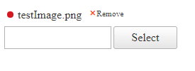

# Common Issues

This help article lists the most common issues one can face when using the **RadAsyncUpload** control and offers possible solutions for them.


##  Missing Handler Registration

One of the most common cause for failures is a missing or incorrect **Telerik.Web.UI.WebResource.axd** handler registration.

Detailed information on how to register the handler can be found here: [Web Resources Troubleshooting]()

You can quickly check if the handler is registered by accessing it directly: `http://<site root>/Telerik.Web.UI.WebResource.axd` This request should succeed and return a blank page.

## RadAsyncUpload's Flash module and Windows or Forms Authentication

If Flash module is used (out of the four supported RadAsyncUpload upload modules) the RadAsyncUpload handler must be excluded from Windows Authentication (NTLM) and Forms Authentication, since the Flash module will not authenticate in either mode.	


````XML
<location path="Telerik.Web.UI.WebResource.axd">   
    <system.web>       
        <authorization>
            <allow users="*" />       
        </authorization>   
    </system.web>
</location> 
````

Anonymous Authentication must be enabled in IIS. If AA is disabled, the RadAsyncUpload Flash module should not be used. It can be disabled by inserting this script right before the control definition on the page:


````ASP.NET
<script type="text/javascript">
    Telerik.Web.UI.RadAsyncUpload.Modules.Flash.isAvailable = function () { return false; }
</script> 
````

## Uploading Files Over Secure Connections (HTTPS)

Make sure you're using a valid SSL certificate. If the server uses a self-signed certificate add it as a trusted certificate to your browser.

## Application Pool Impersonation

The **UseApplicationPoolImpersonation** property is implemented in Q3.2012. If set to **true** and a user does not have permission to the **Temporary/TargetFolder** the control can impersonate the Application Pool Identity upon saving the file and this way allow an easier permission configuration. For example when a user is trying to upload a file and have no write permissions RadAsyncUpload impersonates them form the ones that are set to the Application Pool itself. **UseApplicationPoolImpersonation** is working only if the **identity(impersonate="true" property)** in the system.web section of the web.config is set. 

## Using EnableHandlerDetection Property

The **EnableHandlerDetection** propery is available since Q3.2013. By default it is set to **true** and will cause an error to be thrown if the Telerik Web Resource handler (Telerik.Web.UI.WebResource.axd) is not registered in the web.config. If for some reason you need to use the RadAsyncUpload without the handler you can set the property to **false**.

## IE10 Browser does not Support Upload of 0 Bytes Size File.

IE10 browser uploading of zero byte files in not possible currently when using FileApi upload module and that is why RadAsyncUpload will throw an exception in the OnClientFileUploadFailed event with error message: "IE10 browser does not support upload of 0 bytes size file." You can handle it and inform the user about this browser limitation.

## Drag and Drop functionality of RadAsyncUpload not working in IE browser when using Visual Studio as Administrator.

When running a project using Visual Studio in Administrator mode, the Drag and Drop to upload functionality of **RadAsyncUpload** is not working in Internet Explorer browser. This behavior is not observed when the project is hosted in IIS where everything works as expected.

## A Red Dot Is Shown and the File Is not Uploaded



The file upload will fail if the **TemporaryUpload** folder is not given with enough permissions, even if the permissions of the **TargetFolder** are set properly.The default temporary upload folder is placed inside the App_data folder, so you have to give full read and write permissions to it as well:
`~/App_Data/RadUploadTemp `.

Find more troubleshooting tips in the dedicated [Red Dot Shown and File Not Uploaded](https://docs.telerik.com/devtools/aspnet-ajax/knowledge-base/asyncupload-red-dot-shown-file-not-uploaded-troubleshooting) knowledge base article.

## Cannot Upload Files From Google Drive on Android

### Description

When the user on a mobile Android devices tries to upload a file from Google Drive the upload hands and shows a yellow dot. It is caused by a known bug with the Google API that prevents the proper upload from Google Drive on Android devices. This interferes with the use of FileAPI to upload files, hence the issue with the AsyncUpload:

* [https://bugs.chromium.org/p/chromium/issues/detail?id=1063576&q=ERR_UPLOAD_FILE_CHANGED&can=2](https://bugs.chromium.org/p/chromium/issues/detail?id=1063576&q=ERR_UPLOAD_FILE_CHANGED&can=2 ) 
* [https://stackoverflow.com/questions/57516930/prevent-html-file-input-from-selecting-files-in-google-drive-while-using-android](https://stackoverflow.com/questions/57516930/prevent-html-file-input-from-selecting-files-in-google-drive-while-using-android) 
* [https://support.google.com/chrome/thread/3125379?hl=en](https://support.google.com/chrome/thread/3125379?hl=en) 
* [https://stackoverflow.com/questions/62714319/attached-from-google-drivecloud-storage-in-android-file-gives-err-upload-file](https://stackoverflow.com/questions/62714319/attached-from-google-drivecloud-storage-in-android-file-gives-err-upload-file)
* [https://groups.google.com/a/chromium.org/forum/#!searchin/chromium-bugs/err_upload_file_changed%7Csort:date/chromium-bugs/9LU9A878N7g/6NNxA7R8p78J](https://groups.google.com/a/chromium.org/forum/#!searchin/chromium-bugs/err_upload_file_changed%7Csort:date/chromium-bugs/9LU9A878N7g/6NNxA7R8p78J)


### Solution

The solution is to use the fallback iframe upload module when the browser is Chrome and the platform is Android. More info about the upload modules of the AsyncUpload can be found in [RadAsyncUpload Modules]() article.

Placing the following script under the ScriptManager will force the AsyncUpload to use the iframe module over the FileAPI:

````ASP.NET
<script>
    if (Telerik.Web.Platform.android && Telerik.Web.Browser.chrome && Telerik.Web.UI.RadAsyncUpload) {
        // force iframe mode due to https://bugs.chromium.org/p/chromium/issues/detail?id=1063576&q=ERR_UPLOAD_FILE_CHANGED&can=2
        Telerik.Web.UI.RadAsyncUpload.Modules.FileApi.isAvailable = function () { return false; };
        Telerik.Web.UI.RadAsyncUpload.Modules.Flash.isAvailable = function () { return false; };
        Telerik.Web.UI.RadAsyncUpload.Modules.Silverlight.isAvailable = function () { return false; };
    }
</script>
````


## See Also
