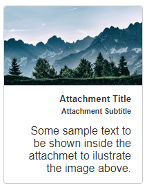
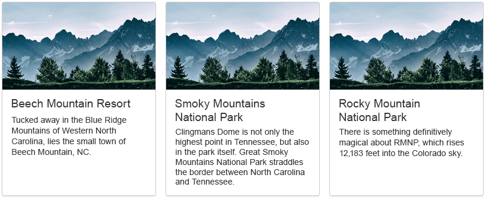

# Default Cards

Rich cards are complex attachment messages that can contain additional message styling, templates, and images. The **RadChat** control supports the default **[heroCards](https://docs.botframework.com/en-us/node/builder/chat-reference/classes/_botbuilder_d_.herocard.html)** template which can be displayed in the chat flow when calling the `renderAttachments` method of the control and pass `heroCard` as a value for the `contentType` property of an attachment.

>caption **Figure 1**: A default HeroCard template.




````ASP.NET
<telerik:RadChat runat="server" ID="RadChat1">
    <ClientEvents OnLoad="OnLoad"/>
    <MessagesSettings Placeholder="Type your message here..." />
    <UserSettings Name="John" IconUrl="avatar.png" />
</telerik:RadChat>
 ````

````JavaScript
function OnLoad(sender, args) {
    var chat = sender;
    chat.renderAttachments({
        attachments: [{
            contentType: "heroCard",
            content: {
                title: "Attachment Title",
                subtitle: "Attachment Subtitle",
                text: "Some sample text to be shown inside the attachment to illustrate the image above.",
                images: [{
                    url: "mountain.png",
                    alt: "mountain"
                }]
            }
        }],
        attachmentLayout: "carousel"
    }, chat.get_user());
}
````

The layout of a collection of attachments can be: 
* **Carousel** - displays multiple cards *horizontally*. In this mode, you can browse the available cards with left/right swipe or with a click on a card and dragging sideways;
* **List** - displays multiple cards *vertically*; 

>caption **Figure 2**: A Carousel cards layout.



>caption **Figure 3**: A List cards layout.


To further customize the appearance of a card, you can also use [Custom Templates]() and [Custom Components]() articles.

# See Also

 * [RadChat Structure]()

 * [RadChat Server-Side Programming]()

 * [RadChat Client-Side Programming]()

 * [RadChat Online Demos](https://demos.telerik.com/aspnet-ajax/chat/overview/defaultcs.aspx)

 
