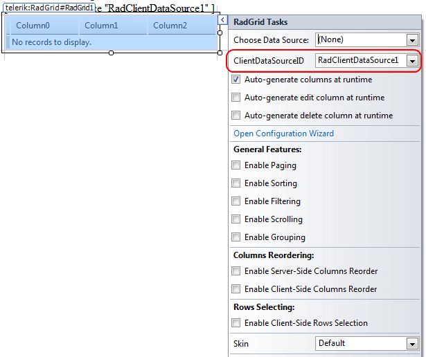

# Connecting to Web Service

Instructions to create and configure the RadClientDataSource.

## Create & Bind the Controls

* From the **Toolbox** in **Visual Studio**, drag a **RadClientDataSource** and **RadGrid** instance to the design surface of your page.
* Define the url to the **WebService** using the **Url** property. In this example we are using "**https://demos.telerik.com/kendo-ui/service/Northwind.svc/Products**"

````XML
<telerik:RadClientDataSource ID="RadClientDataSource1" runat="server">
    <DataSource>
        <WebServiceDataSourceSettings ServiceType="OData">
            <Select Url="https://demos.telerik.com/kendo-ui/service/Northwind.svc/Products" DataType="JSONP" />
        </WebServiceDataSourceSettings>
    </DataSource>
</telerik:RadClientDataSource>
````

* Configure the **Model Schema** and set the **Fileds** for the data source control

````XML
<telerik:RadClientDataSource ID="RadClientDataSource1" runat="server">
    <DataSource>
        <WebServiceDataSourceSettings ServiceType="OData">
            <Select Url="https://demos.telerik.com/kendo-ui/service/Northwind.svc/Products" DataType="JSONP" ContentType="application/json" />
        </WebServiceDataSourceSettings>
    </DataSource>
    <Schema GroupsName="ProductName">
        <Model ID="Model1">
            <telerik:ClientDataSourceModelField FieldName="ProductName" DataType="String" Editable="true" IgnoreCase="true" />
            <telerik:ClientDataSourceModelField FieldName="QuantityPerUnit" DataType="String" Nullable="false" />
            <telerik:ClientDataSourceModelField FieldName="UnitPrice" DataType="Number" />
            <telerik:ClientDataSourceModelField FieldName="UnitsInStock" DataType="Number" />
            <telerik:ClientDataSourceModelField FieldName="Discontinued" DataType="Boolean" />
        </Model>
    </Schema>
    <GroupExpressions>
        <telerik:ClientDataSourceGroupExpression FieldName="ProductName">
        </telerik:ClientDataSourceGroupExpression>
    </GroupExpressions>
</telerik:RadClientDataSource>	
````

* Assign the ClientDataSource to the **DataBound** control (e.g. RadGrid)

**Using Visual Studio Designer**
  

 
**Using the Source**

````XML
<telerik:RadGrid ID="RadGrid1" runat="server" AllowPaging="True" AllowFilteringByColumn="true" ClientDataSourceID="RadClientDataSource1">
    <MasterTableView AutoGenerateColumns="False">
        <Columns>
            <telerik:GridBoundColumn DataField="ProductName" UniqueName="ProductName" HeaderText="ProductName">
            </telerik:GridBoundColumn>

            <telerik:GridBoundColumn DataField="QuantityPerUnit" UniqueName="QuantityPerUnit" HeaderText="QuantityPerUnit">
            </telerik:GridBoundColumn>

            <telerik:GridNumericColumn DataField="UnitPrice" UniqueName="UnitPrice" HeaderText="UnitPrice">
            </telerik:GridNumericColumn>

            <telerik:GridNumericColumn DataField="UnitsInStock" UniqueName="UnitsInStock" HeaderText="UnitsInStock">
            </telerik:GridNumericColumn>

            <telerik:GridBoundColumn DataField="Discontinued" UniqueName="Discontinued" HeaderText="Discontinued">
            </telerik:GridBoundColumn>
        </Columns>
    </MasterTableView>
</telerik:RadGrid>
````

**Result**


 
