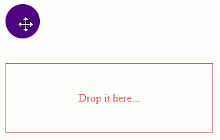

# Getting Started

For a basic scenario, you will have to:

- [Create Draggables](#create-draggables)
- [Create DropTargets](#create-droptargets)
- [Attach the Drop event listener to DropTarget](#attach-the-drop-event-listener-to-droptarget)
- [Perform an action when the Drop event fires](#perform-an-action-when-the-drop-event-fires)

## Create Draggables

**Step 1**: Create an Element which will be used as Draggable


````ASP.NET
<asp:Panel ID="Panel1" runat="server" CssClass="myDraggableElement"></asp:Panel>

<style>
    .myDraggableElement {
        width: 50px;
        height: 50px;
        background-color: indigo;
        border-radius: 50%;
        cursor: move;
    }
</style>
````

**Step 2**: Add a RadDraggable to the Page and associate it with the element created in *Step 1*

To associate the RadDraggable with the desired element, use the `TargetSelectors` property.

````ASP.NET
<telerik:RadDraggable runat="server" TargetSelectors=".myDraggableElement">
</telerik:RadDraggable>
````

The element will now have a Draggable.


## Create DropTargets

**Step 1**: Create an element that will act as a Drop target


````ASP.NET
<asp:Panel ID="Panel2" runat="server" CssClass="myDropTargetElement">
    <asp:Label ID="Label2" runat="server" Text="Drop it here..."></asp:Label>
</asp:Panel>

<style>
    .myDropTargetElement {
        width: 300px;
        height: 100px;
        line-height: 100px;
        border: 1px solid indianred;
        text-align: center;
        color: indianred;
        user-select: none;
    }
</style>
````

**Step 2**: Add a RadDropTarget to the Page and associate it with the element created in *Step 1*


````ASP.NET
<telerik:RadDropTarget runat="server" TargetSelectors=".myDropTargetElement">
</telerik:RadDropTarget>
````

This element now acts as a Drop Target and will allow Draggables to be Dropped in it.


## Attach the Drop event listener to DropTarget

To complete the scenario, you will have to attach event listeners that will fire when the drag of an element starts, in dragging process, when the drag ends, draggable drops, etc..

In this basic example, we will use the `Drop` event of RadDropTarget.

**Step 1**: Attach the `Drop` event listener

Create a JavaScript function (e.g. DropTargetOnDrop)

````JavaScript
<script>
    function DropTargetOnDrop(sender, args) {

    }
</script>
````

**Step 2**: Subscribe to the `Drop` event

Subscribe the JavaScript function to the `Drop` event

````ASP.NET
<telerik:RadDropTarget runat="server" TargetSelectors=".myDropTargetElement">
    <ClientEvents OnDrop="DropTargetOnDrop" />
</telerik:RadDropTarget>
````

## Perform an action when the Drop event fires

Upon Dropping the Draggable into the DropTarget the Drop event will fire. Using the event handler created earlier (DropTargetOnDrop), you can perform actions like changing the style, or modifying elements, etc.

````JavaScript
<script>
    // OnDrop event listener
    function DropTargetOnDrop(sender, args) {
        // Get reference to the DropTarget element
        var $dropTargetJqueryOject = args.get_dropTarget();

        // Assign a new CSS class to DropTarget
        $dropTargetJqueryOject.addClass('fill');

        // Find the Label within the DropTarget element
        var lbl2 = $get('<%= Label2.ClientID %>');

        // Change the Label Text
        lbl2.innerText = "You did great! Draggable dropped.";
    }
</script>
````

The "fill" CSS

````CSS
<style>
    .myDropTargetElement.fill {
        border: none;
        background-color: indigo;
        color: hotpink;
    }
</style>
````

>caption Result



 