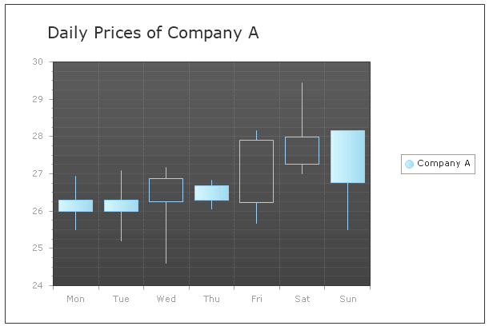
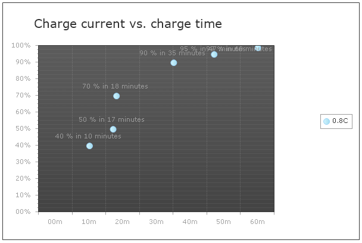
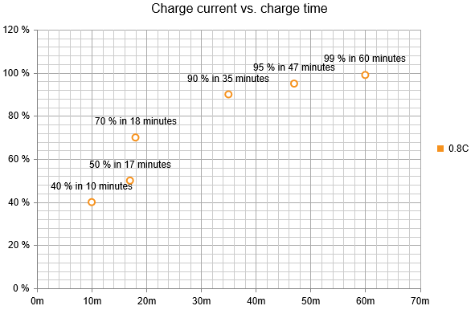

# Migrate Data Binding Configuration

This article illustrates how to migrate the configuration of data binding with discrete and continuous data from **RadChart** to the [ASP.NET AJAX Chart](https://www.telerik.com/products/aspnet-ajax/html-chart.aspx). The examples illustrate how to migrate the data binding declaratively. However, you can use the same classes and properties of the series and axis to programmatically migrate the configuration of the data binding.

## Data Binding Discrete Data

### Data Binding Discrete Data in RadChart

Data-bound specific properties in **RadChart** are configured in the following objects:

* **XAxis** - The object holds the corresponding x-axis related property - **DataLabelsColumn**.

* **ChartSeries** - The object holds the corresponding y-axis related properties - **DataYColumn**, **DataYColumn2**, **DataYColumn3** and **DataYColumn4**.

The code in **Example 1** illustrates how to bind discrete data in a Candlestick series with **RadChart** and is shown in **Figure 1**.

>caption Figure 1: Display data-bound discrete data in a Candlestick series with RadChart.



>caption Example 1: Configuring data binding of discrete data in a Candlestick series with **RadChart**.


````ASP.NET
<telerik:RadChart ID="RadChart1" runat="server" Width="600px" Height="400px">
	<Series>
		<telerik:ChartSeries Type="CandleStick" DataYColumn="OpenField" DataYColumn3="HighField" DataYColumn4="LowField" DataYColumn2="CloseField" Name="Company A">
			<Appearance>
				<LabelAppearance Visible="false"></LabelAppearance>
			</Appearance>
		</telerik:ChartSeries>
	</Series>
	<PlotArea>
		<XAxis DataLabelsColumn="DayField"></XAxis>
		<YAxis MinValue="24" MaxValue="30" AutoScale="false"></YAxis>
	</PlotArea>
	<ChartTitle TextBlock-Text="Daily Prices of Company A"></ChartTitle>
</telerik:RadChart>
````
````C#
protected void Page_Load(object sender, EventArgs e)
{
	RadChart1.DataSource = GetData();
	RadChart1.DataBind();
}
protected DataTable GetData()
{
	DataTable dt = new DataTable();

	dt.Columns.Add("ID", typeof(byte));
	dt.Columns.Add("OpenField", typeof(float));
	dt.Columns.Add("HighField", typeof(float));
	dt.Columns.Add("LowField", typeof(float));
	dt.Columns.Add("CloseField", typeof(float));
	dt.Columns.Add("DayField", typeof(string));

	dt.Rows.Add(1, 26.29, 26.93, 25.49, 26.00, "Mon");
	dt.Rows.Add(2, 26.30, 27.09, 25.20, 25.99, "Tue");
	dt.Rows.Add(3, 26.25, 27.18, 24.60, 26.87, "Wed");
	dt.Rows.Add(4, 26.68, 26.82, 26.06, 26.29, "Thu");
	dt.Rows.Add(5, 26.22, 28.15, 25.67, 27.91, "Fri");
	dt.Rows.Add(6, 27.25, 29.44, 27.01, 27.99, "Sat");
	dt.Rows.Add(7, 28.15, 28.15, 25.49, 26.76, "Sun");

	return dt;
}
````
````VB
Protected Sub Page_Load(sender As Object, e As EventArgs)
	RadChart1.DataSource = GetData()
	RadChart1.DataBind()
End Sub
Protected Function GetData() As DataTable
	Dim dt As New DataTable()

	dt.Columns.Add("ID", GetType(Byte))
	dt.Columns.Add("OpenField", GetType(Single))
	dt.Columns.Add("HighField", GetType(Single))
	dt.Columns.Add("LowField", GetType(Single))
	dt.Columns.Add("CloseField", GetType(Single))
	dt.Columns.Add("DayField", GetType(String))

	dt.Rows.Add(1, 26.29, 26.93, 25.49, 26.0, "Mon")
	dt.Rows.Add(2, 26.3, 27.09, 25.2, 25.99, "Tue")
	dt.Rows.Add(3, 26.25, 27.18, 24.6, 26.87, "Wed")
	dt.Rows.Add(4, 26.68, 26.82, 26.06, 26.29, "Thu")
	dt.Rows.Add(5, 26.22, 28.15, 25.67, 27.91, "Fri")
	dt.Rows.Add(6, 27.25, 29.44, 27.01, 27.99, "Sat")
	dt.Rows.Add(7, 28.15, 28.15, 25.49, 26.76, "Sun")

	Return dt
End Function
````

### Data Binding Discrete Data in RadHtmlChart

Data-bound specific properties in **RadHtmlChart** are configured in the following objects:

* **XAxis** - The object holds the corresponding x-axis related property - **DataLabelsField**.

* **[Series Type]** - The object holds the corresponding y-axis related properties. **RadHtmlChart** exposes specific data-bound properties for each series type, which makes the configuration much easier and intuitive. **Table 1** lists the corresponding data-bound properties for each category series type.

>caption Table 1: List of data-bound properties for the corresponding category series types.

| Series Type | Series Data-bound Properties |
| ------ | ------ |
|Bar, Column, Area, Line|DataFieldY|
|Candlestick|DataOpenField, DataHighField, DataLowField, DataCloseField|
|Pie|DataFieldY|

The code in **Example 2** illustrates how to bind discrete data in a Candlestick series with **RadHtmlChart** in **Figure 2**.

>caption Figure 2: Display data-bound discrete data in a Candlestick series with RadHtmlChart.


>caption Example 2: Configuring data binding of discrete data in a Candlestick series with **RadHtmlChart**.

````ASP.NET
<telerik:RadHtmlChart ID="RadHtmlChart1" runat="server" Width="600px" Height="400px">
	<PlotArea>
		<Series>
			<telerik:CandlestickSeries DataOpenField="OpenField" DataHighField="HighField" DataLowField="LowField" DataCloseField="CloseField" Name="Company A"></telerik:CandlestickSeries>
		</Series>
		<XAxis DataLabelsField="DayField"></XAxis>
		<YAxis MinValue="24" MaxValue="30"></YAxis>
	</PlotArea>
	<ChartTitle Text="Daily Prices of Company A"></ChartTitle>
</telerik:RadHtmlChart>
````
````C#
protected void Page_Load(object sender, EventArgs e)
{
	RadHtmlChart1.DataSource = GetData();
	RadHtmlChart1.DataBind();
}
protected DataTable GetData()
{
	DataTable dt = new DataTable();

	dt.Columns.Add("ID", typeof(byte));
	dt.Columns.Add("OpenField", typeof(float));
	dt.Columns.Add("HighField", typeof(float));
	dt.Columns.Add("LowField", typeof(float));
	dt.Columns.Add("CloseField", typeof(float));
	dt.Columns.Add("DayField", typeof(string));

	dt.Rows.Add(1, 26.29, 26.93, 25.49, 26.00, "Mon");
	dt.Rows.Add(2, 26.30, 27.09, 25.20, 25.99, "Tue");
	dt.Rows.Add(3, 26.25, 27.18, 24.60, 26.87, "Wed");
	dt.Rows.Add(4, 26.68, 26.82, 26.06, 26.29, "Thu");
	dt.Rows.Add(5, 26.22, 28.15, 25.67, 27.91, "Fri");
	dt.Rows.Add(6, 27.25, 29.44, 27.01, 27.99, "Sat");
	dt.Rows.Add(7, 28.15, 28.15, 25.49, 26.76, "Sun");

	return dt;
}
````
````VB
Protected Sub Page_Load(sender As Object, e As EventArgs)
	RadHtmlChart1.DataSource = GetData()
	RadHtmlChart1.DataBind()
End Sub
Protected Function GetData() As DataTable
	Dim dt As New DataTable()

	dt.Columns.Add("ID", GetType(Byte))
	dt.Columns.Add("OpenField", GetType(Single))
	dt.Columns.Add("HighField", GetType(Single))
	dt.Columns.Add("LowField", GetType(Single))
	dt.Columns.Add("CloseField", GetType(Single))
	dt.Columns.Add("DayField", GetType(String))

	dt.Rows.Add(1, 26.29, 26.93, 25.49, 26.0, "Mon")
	dt.Rows.Add(2, 26.3, 27.09, 25.2, 25.99, "Tue")
	dt.Rows.Add(3, 26.25, 27.18, 24.6, 26.87, "Wed")
	dt.Rows.Add(4, 26.68, 26.82, 26.06, 26.29, "Thu")
	dt.Rows.Add(5, 26.22, 28.15, 25.67, 27.91, "Fri")
	dt.Rows.Add(6, 27.25, 29.44, 27.01, 27.99, "Sat")
	dt.Rows.Add(7, 28.15, 28.15, 25.49, 26.76, "Sun")

	Return dt
End Function
````

## Data Binding Continuous Data

### Data Binding Continuous Data in RadChart

Data-bound specific properties in **RadChart** are configured in the **ChartSeries** object:

* The corresponding x-axis related properties are **DataXColumn** and **DataXColumn2**.

* The corresponding y-axis related properties are **DataYColumn**, **DataYColumn2**, **DataYColumn3** and **DataYColumn4**.

The code in **Example 3** illustrates how to bind continuous data in a Point series with **RadChart** and is shown in **Figure 3**.

>caption Figure 3: Display data-bound continuous data in a Point series with RadChart.



>caption Example 3: Configuring data binding of continuous data in a Point series with **RadChart**.

````ASP.NET
<telerik:RadChart ID="RadChart1" runat="server" Width="600px" Height="400px">
	<Series>
		<telerik:ChartSeries Type="Point" DataXColumn="xField" DataYColumn="yField" Name="0.8C" DefaultLabelValue="#Y{P0} in #X minutes">
		</telerik:ChartSeries>
	</Series>
	<PlotArea>
		<XAxis Appearance-CustomFormat="0#m"></XAxis>
		<YAxis Appearance-CustomFormat="0#%"></YAxis>
	</PlotArea>
	<ChartTitle TextBlock-Text="Charge current vs. charge time"></ChartTitle>
</telerik:RadChart>
````
````C#
protected void Page_Load(object sender, EventArgs e)
{
	RadChart1.DataSource = GetData();
	RadChart1.DataBind();
}

protected DataTable GetData()
{
	DataTable dt = new DataTable();

	dt.Columns.Add("ID", typeof(byte));
	dt.Columns.Add("xField", typeof(float));
	dt.Columns.Add("yField", typeof(float));

	dt.Rows.Add(1, 10, 0.40);
	dt.Rows.Add(2, 17, 0.50);
	dt.Rows.Add(3, 18, 0.70);
	dt.Rows.Add(4, 35, 0.90);
	dt.Rows.Add(5, 47, 0.95);
	dt.Rows.Add(6, 60, 0.99);

	return dt;
}
````
````VB
Protected Sub Page_Load(sender As Object, e As EventArgs)
	RadChart1.DataSource = GetData()
	RadChart1.DataBind()
End Sub

Protected Function GetData() As DataTable
	Dim dt As New DataTable()

	dt.Columns.Add("ID", GetType(Byte))
	dt.Columns.Add("xField", GetType(Single))
	dt.Columns.Add("yField", GetType(Single))

	dt.Rows.Add(1, 10, 0.4)
	dt.Rows.Add(2, 17, 0.5)
	dt.Rows.Add(3, 18, 0.7)
	dt.Rows.Add(4, 35, 0.9)
	dt.Rows.Add(5, 47, 0.95)
	dt.Rows.Add(6, 60, 0.99)

	Return dt
End Function
````

### Data Binding Continuous Data in RadHtmlChart

Data-bound specific properties in **RadHtmlChart** are configured in the **[Series Type]** object. The series object holds the corresponding x-axis and y-axis related properties. **RadHtmlChart** exposes specific data-bound properties for each series type, which makes the configuration much easier and intuitive. **Table 2** lists the corresponding data-bound properties for each numeric series type.

>caption Table 2: List of data-bound properties for the corresponding numeric series types.

| Series Type | Series Data-bound Properties |
| ------ | ------ |
|Scatter, ScatterLine|DataFieldY, DataFieldX|
|Bubble|DataFieldY, DataFieldX, DataFieldSize, DataFieldTooltip|

The code in **Example 4** illustrates how to bind continuous data in a Scatter series with **RadHtmlChart** as shown in **Figure 4**.

>caption Figure 4: Display data-bound continuous data in a Scatter series with RadHtmlChart.



>caption Example 4: Configuring data binding of continuous data in a Scatter series with **RadHtmlChart**.

````ASP.NET
<telerik:RadHtmlChart ID="RadHtmlChart1" runat="server" Width="600px" Height="400px">
	<PlotArea>
		<Series>
			<telerik:ScatterSeries DataFieldX="xField" DataFieldY="yField" Name="0.8C">
				<LabelsAppearance DataFormatString="{1:P0} in {0} minutes"></LabelsAppearance>
			</telerik:ScatterSeries>
		</Series>
		<XAxis>
			<LabelsAppearance DataFormatString="{0}m"></LabelsAppearance>
		</XAxis>
		<YAxis>
			<LabelsAppearance DataFormatString="{0:P0}"></LabelsAppearance>
		</YAxis>
	</PlotArea>
	<ChartTitle Text="Charge current vs. charge time"></ChartTitle>
</telerik:RadHtmlChart>
````
````C#
protected void Page_Load(object sender, EventArgs e)
{
	RadHtmlChart1.DataSource = GetData();
	RadHtmlChart1.DataBind();
}

protected DataTable GetData()
{
	DataTable dt = new DataTable();

	dt.Columns.Add("ID", typeof(byte));
	dt.Columns.Add("xField", typeof(float));
	dt.Columns.Add("yField", typeof(float));

	dt.Rows.Add(1, 10, 0.40);
	dt.Rows.Add(2, 17, 0.50);
	dt.Rows.Add(3, 18, 0.70);
	dt.Rows.Add(4, 35, 0.90);
	dt.Rows.Add(5, 47, 0.95);
	dt.Rows.Add(6, 60, 0.99);

	return dt;
}
````
````VB
Protected Sub Page_Load(sender As Object, e As EventArgs)
	RadHtmlChart1.DataSource = GetData()
	RadHtmlChart1.DataBind()
End Sub

Protected Function GetData() As DataTable
	Dim dt As New DataTable()

	dt.Columns.Add("ID", GetType(Byte))
	dt.Columns.Add("xField", GetType(Single))
	dt.Columns.Add("yField", GetType(Single))

	dt.Rows.Add(1, 10, 0.4)
	dt.Rows.Add(2, 17, 0.5)
	dt.Rows.Add(3, 18, 0.7)
	dt.Rows.Add(4, 35, 0.9)
	dt.Rows.Add(5, 47, 0.95)
	dt.Rows.Add(6, 60, 0.99)

	Return dt
End Function
````

## See Also

 * [RadHtmlChart : Migrating Axes Configuration]()

 * [RadHtmlChart : Migrating Date Axis Configuration]()

 * [RadHtmlChart : Migrating Functionalities - Features and Series Types Parity]()

 * [RadHtmlChart : Migrating Series Configuration]()
