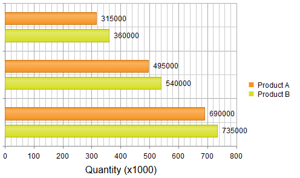

# Using Client Templates in Legend and Axes Labels

This article discusses the client templates for **Legend** items and **Axes** labels exposed in the [ASP.NET AJAX Chart](https://www.telerik.com/products/aspnet-ajax/html-chart.aspx).

The features listed here are available as of **R2 2016**.

You can quickly navigate through the sections in this article:

1.  [Client Templates for Legend Items](#client-templates-for-legend-items)
2.  [Client Templates for Axes Labels](#client-templates-for-axes-labels)

## Client Templates for Legend Items

The client template for the **Legend** items can be controlled by using the `ClientTemplate` property, exposed in the `LabelsAppearance` property (**Example 1**). 

The values that can be resolved and used in the client templates are:

* `text` - the text the legend item.
* `series` - the data series.
* `value` - the point value. (only for donut and pie charts)
* `percentage` - the point value represented as a percentage value. Available only for donut, pie and 100% stacked charts.

More details are avilable in **Kendo** documentation—[legend.labels.template](https://docs.telerik.com/kendo-ui/api/javascript/dataviz/ui/chart#configuration-legend.labels.template).

>caption Figure 1: Result from the code in **Example 1**.


>caption Example 1: Using client templates for the **Legend** items.

````ASP.NET
<telerik:RadHtmlChart runat="server" ID="BarChart1" Width="500px" Height="300px">
    <PlotArea>
        <Series>
            <telerik:BarSeries Name="Product A">
                <SeriesItems>
                    <telerik:CategorySeriesItem Y="315000" />
                    <telerik:CategorySeriesItem Y="495000" />
                    <telerik:CategorySeriesItem Y="690000" />
                </SeriesItems>
            </telerik:BarSeries>
            <telerik:BarSeries Name="Product B">
                <SeriesItems>
                    <telerik:CategorySeriesItem Y="360000" />
                    <telerik:CategorySeriesItem Y="540000" />
                    <telerik:CategorySeriesItem Y="735000" />
                </SeriesItems>
            </telerik:BarSeries>
        </Series>
    </PlotArea>
    <Legend>
        <Appearance Position="Bottom" >
            <ClientTemplate>
                #= text # 
                # var values = []#
                # for (var i = 0; i < series.data.length; i++) {  
                   values.push(series.data[i].value);
                 } #
                \n
                Max: #= Math.max(...values) #
            </ClientTemplate>
        </Appearance>
    </Legend>
</telerik:RadHtmlChart>
````

## Client Templates for Axes Labels

The client template for the axes' labels can be controlled by using the `ClientTemplate` property, exposed in the `LabelsAppearance` property (**Example 2**). 

The value that can be resolved and used in the client templates is:

* `value` - the text of the axis' label.

More details are available in the **Kendo** documentation—[valueAxis.labels.template](https://docs.telerik.com/kendo-ui/api/javascript/dataviz/ui/chart#configuration-valueAxis.labels.template).

>caption Figure 2: Result from the code in **Example 2**.



>caption Example 2: Using client templates for the **Legend** items.

````ASP.NET
<telerik:RadHtmlChart runat="server" ID="BarChart1" Width="500px" Height="300px">
    <PlotArea>
        <Series>
            <telerik:BarSeries Name="Product A">
                <SeriesItems>
                    <telerik:CategorySeriesItem Y="315000" />
                    <telerik:CategorySeriesItem Y="495000" />
                    <telerik:CategorySeriesItem Y="690000" />
                </SeriesItems>
            </telerik:BarSeries>
            <telerik:BarSeries Name="Product B">
                <SeriesItems>
                    <telerik:CategorySeriesItem Y="360000" />
                    <telerik:CategorySeriesItem Y="540000" />
                    <telerik:CategorySeriesItem Y="735000" />
                </SeriesItems>
            </telerik:BarSeries>
        </Series>
        <YAxis>
            <TitleAppearance Text="Quantity (x1000)" />
            <LabelsAppearance>
                <ClientTemplate>
                    #= value / 1000 #
                </ClientTemplate>
            </LabelsAppearance>
        </YAxis>
    </PlotArea>     
</telerik:RadHtmlChart>
````

## See Also

* [ClientTemplate Overview]()

* [Display HTML and Execute JavaScript]()

* [Kedno Chart API: legend.labels.template](https://docs.telerik.com/kendo-ui/api/javascript/dataviz/ui/chart#configuration-legend.labels.template)

* [Kedno Chart API: valueAxis.labels.template](https://docs.telerik.com/kendo-ui/api/javascript/dataviz/ui/chart#configuration-valueAxis.labels.template)

* [Format Numbers]()

* [Format Dates]()

* [Demo: Client Templates for Series and Tooltips](https://demos.telerik.com/aspnet-ajax/htmlchart/examples/functionality/clienttemplates/defaultcs.aspx)
