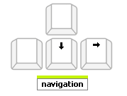
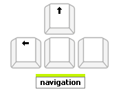
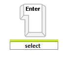

# Keyboard Support


A critical requirement for software accessibility is keyboard support as a complete alternative to pointing devices (mouse, etc.). Keyboard support is comprised of navigation key, command key, keyboard navigation, and action keys. **RadPanelBar** seamlessly switches between mouse and keyboard navigation.

## KeyboardNavigationSettings


Setting the control's **KeyboardNavigationSettings** (*introduced in R2 2016 - ver.2016.2.504*), allows you to associate an activation combination (**CommandKey** + **FocusKey**), which moves focus directly to the **RadPanelBar** and enables keyboard navigation. When there are multiple **RadPanelBar** controls on a given page, each of them may have a different activation combination.

The **KeyboardNavigationSettings** exposes two properties to configure the keyboard combination that sets focus to the control:

* **FocusKey**: An upper-case letter or number.

* **CommandKey**: [Ctrl] , [Alt] or [Shift].

Pressing the keys set to these two properties at the same time places the focus on the PanelBar. The user can then use the **arrow keys** to navigate among the items in the control or the **action keys** to trigger specific action.

**Example 1**: Setting the **KeyboardNavigationSettings** for **RadPanelBar**

````ASPNET
<telerik:RadPanelBar RenderMode="Lightweight" ID="RadPanelBar1" runat="server" >
    <KeyboardNavigationSettings CommandKey="Alt" FocusKey="W" />
</telerik:RadPanelBar>
````


>note Note that in some browsers certain keyboard combinations are already occupied and used by the browser itself.
>


## Keyboard navigation

Keyboard navigation is supported by using the **arrow keys** and special keyboard shortcuts:

* To move forward (down), use the [Down arrow] or the [Right arrow] key.

	

* To move backward (up), use the [Up arrow] or the [Left arrow] key.

	

* To move to the parent of the focused item, use [Ctrl] + [Up arrow].

	

* To move to the first sibling element at the same level of the currently active item, use the [Home] key.

	

* To move to the last sibling element at the same level of the currently active item, use the [End] key.

	

>note The arrow keyboard navigation includes all visible panel items, regardless of their level
>


## Action keys

**RadPanelBar** uses also two action keys to perform specific actions:

* To expand or collapse child items of an item, use the [Space] key.

	

* To select / trigger click on an item, use the [Enter] key.

	


>note Collapsing items does not always work. It depends on the [ExpandMode property]().
>


# See Also

 * [RadPanelBar Item Builder]()

 * [PanelBar - Keyboard Support demo](https://demos.telerik.com/aspnet-ajax/panelbar/examples/functionality/keyboardsupport/defaultcs.aspx)
