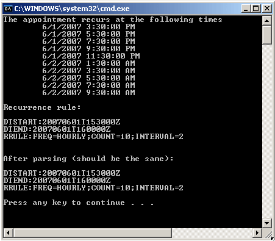

# Working with Recurring Appointments


**RadScheduler** includes support for recurring events on hourly, weekly, daily, monthly and yearly basis. Exceptions to the recurrence rules are also permitted. To support this recurrence behavior, the **Appointment** class includes the **RecurrenceRule**, **RecurrenceParentID** and **RecurrenceState** properties. When an appointment is promoted into a recurring event its **RecurrenceState** changes to **RecurrenceState.Master** and the **RecurrenceRule** is populated with the string representation of the recurrence rule.

The recurrence master is stored in the database and its occurrences are generated on the fly with **RecurrenceState** set to **RecurrenceState.Occurrence**. The maximum number of generated occurrences is controlled by the **MaximumRecurrenceCandidates** property of the **RadScheduler** which has 3000 as the default value.

If the user modifies an individual appointment occurrence, this creates an exception. The **RecurrenceRule** of the master is modified to include the date and time of the exception so that no occurrence is generated for the exception occurrence. Then the exception is stored in the database and its **RecurrenceParentID** property is set to reference the original master. This way the exception is still linked to the original recurrence series.

The **RecurrenceRule** class is the engine for creating and evaluating recurrence rules. It serves as a base class to several specialized classes and cannot be instantiated directly. The specialized classes are:

* HourlyRecurrenceRule

* DailyRecurrenceRule

* WeeklyRecurrenceRule

* MonthlyRecurrenceRule

* YearlyRecurrenceRule

Using the specialized classes makes it easier to define recurrence rules because only relevant parameters are specified in their constructors.

## Example

Here is an example using the **HourlyRecurrenceRule** class:


````C#
	     
using System;
using Telerik.Web.UI;
namespace RecurrenceExamples
{
class ParsingExample
{
   static void Main()
  {
	   // Create a sample appointment that starts at 6/1/2007 3:30 PM and lasts half an hour.
	   Appointment recurringAppointment =
		 new Appointment("1",
		   Convert.ToDateTime("6/1/2007 3:30 PM").ToUniversalTime(),
		   Convert.ToDateTime( "6/1/2007 4:00 PM").ToUniversalTime(),
		   "Sample appointment");
	   // Create a recurrence range, that specifies a limit of 10 occurrences for the appointment.
	   RecurrenceRange range = new RecurrenceRange();
	   range.Start = recurringAppointment.Start;
	   range.EventDuration = recurringAppointment.End - recurringAppointment.Start;
	   range.MaxOccurrences = 10;
	   // Create a recurrence rule to repeat the appointment every 2 hours.
	   HourlyRecurrenceRule rrule = new HourlyRecurrenceRule(2, range);
	   Console.WriteLine("The appointment recurs at the following times");
	   foreach (DateTime occurrence in rrule.Occurrences)
	   {
		  Console.WriteLine( "\t{0}", occurrence);
	   }
	   Console.WriteLine();
	   // Prints the string representation of the recurrence rule:
	   string rruleAsString = rrule.ToString();
	   Console.WriteLine("Recurrence rule:\n\n{0}\n", rruleAsString);
	   // The string representation can be stored in a database, etc.
	   // ...
	   // Then it can be reconstructed using TryParse method:
	   RecurrenceRule parsedRule;
	   RecurrenceRule.TryParse(rruleAsString, out parsedRule);
	   Console.WriteLine("After parsing (should be the same):\n\n{0}", parsedRule);
  }
}
} 
				
````
````VB.NET
	
Imports System
Imports Telerik.Web.UI
Namespace RecurrenceExamples
	Class ParsingExample
		Shared Sub Main()
			' Create a sample appointment that starts at 6/1/2007 3:30 PM and lasts half an hour.
			Dim recurringAppointment As New Appointment("1", Convert.ToDateTime("6/1/2007 3:30 PM").ToUniversalTime(), Convert.ToDateTime("6/1/2007 4:00 PM").ToUniversalTime(), "Sample appointment")
			' Create a recurrence range, that specifies a limit of 10 occurrences for the appointment.
			Dim range As New RecurrenceRange()
			range.Start = recurringAppointment.Start
			range.EventDuration = recurringAppointment.[End] - recurringAppointment.Start
			range.MaxOccurrences = 10
			' Create a recurrence rule to repeat the appointment every 2 hours.
			Dim rrule As New HourlyRecurrenceRule(2, range)
			Console.WriteLine("The appointment recurs at the following times")
			For Each occurrence As DateTime In rrule.Occurrences
				Console.WriteLine("" & Chr(9) & "{0}", occurrence)
			Next
			Console.WriteLine()
			' Prints the string representation of the recurrence rule:
			Dim rruleAsString As String = rrule.ToString()
			Console.WriteLine("Recurrence rule:" & Chr(10) & "" & Chr(10) & "{0}" & Chr(10) & "", rruleAsString)
			' The string representation can be stored in a database, etc.
			' ...
			' Then it can be reconstructed using TryParse method:
			Dim parsedRule As RecurrenceRule
			RecurrenceRule.TryParse(rruleAsString, parsedRule)
			Console.WriteLine("After parsing (should be the same):" & Chr(10) & "" & Chr(10) & "{0}", parsedRule)
		End Sub
	End Class
End Namespace
	
````


The **RecurrenceRange** class specifies the time frame for the recurrence. It consists of the start timeof the event, it's duration and optional limits.

The **Occurrences** property returns an enumerator that can be used to retrieve all the occurrences defined by the rule.

The **RecurrenceRule** class supports the **ToString** and **TryParse** methods that **RadScheduler** uses for storing and retrieving the recurrence rules instances. The format is a subset of the standard iCalendar format. The example above produces the following output: 


# See Also

 * [Working with RadScheduler recurring appointments on SQL server blog post](https://www.telerik.com/blogs/working-with-radscheduler-recurring-appointments-on-sql-server)
 * [SQL Reporting: Display All Recurring Appointments](https://www.telerik.com/forums/sql-reporting-display-all-recurring-appointments) forum thread


