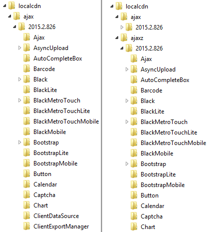

# Custom CDN Provider

A custom (especially local) CDN provider is useful in cases where the application runs on an Intranet or the client machines are otherwise restricted from reaching the cloud where the Telerik CDN is hosted.

In case you want to use your own **CDN provider** for hosting the Telerik UI for ASP.NET AJAX script / css files you need to follow the steps below.

1. Obtain the **CDN resource package** for your controls version. For example, **Telerik_UI_for_ASP.NET_AJAX_2015_2_826_CDN_Resources.zip**.

	This file is available in [your account](https://www.telerik.com/account) and can be found in the Downloads section where all product files for the UI for for ASP.NET AJAX product are located. The location may vary slightly depending on your subscription.

2. Extract the archive. The file structure will look like this:
	* Scripts
		* ajax/[version]
		* ajaxz/[version]
	* Skins
		* ajax/[version]
		* ajaxz/[version]
	* ReadMe

	The Scripts/**ajaxz** folder contains the **compressed** (**gzipped**) JavaScript files. The Scripts/**ajax** folder contains the **uncompressed** JavaScript files for compatibility with older browsers.

3. Copy the content of the Scripts / Skins folder to your CDN host:
	* CDN
		* ajax/[version]
		* ajaxz[version]
		
 	Example: 

	 
 

4. Using **Uncompressed Resources** in IIS
	* Enable **Dynamic** and **Static** Compression
	* Configure **RadScriptManager** and **RadStyleSheetManager**:

		**ASP.NET**

			<telerik:RadStyleSheetManager ID="RadStyleSheetManager1" runat="server" OutputCompression="Disabled">
					<CdnSettings BaseUrl="http://my.favorite.cdn" BaseSecureUrl="http://my.favorite.cdn" TelerikCdn="Enabled" />
			</telerik:RadStyleSheetManager>
			<telerik:RadScriptManager ID="RadScriptManager1" runat="server" OutputCompression="Disabled">
					<CdnSettings BaseUrl="http://my.favorite.cdn" BaseSecureUrl="https://my.favorite.cdn" TelerikCdn="Enabled" />
			</telerik:RadScriptManager>


5. Using **Compressed Resources** in IIS
	* Disable **Dynamic** and **Static** compression
	* Set HTTP headers
		* Cache-Control: public, max-age=31536000
		* Expires - 1 year from the date of the request, if set dynamically. Far-future date (10 years) if set statically.
		* For all files in the Scripts/ajaxz folder: Content-Encoding: gzip
		* For .css files in the Skins/ajaxz folder: Content-Encoding: gzip

	* Set the **BaseUrl** attribute of the **CdnSettings** property to the domain name of your CDN and TelerikCdn="Enabled":

		**ASP.NET**

			<telerik:RadStyleSheetManager ID="RadStyleSheetManager1" runat="server">
					<CdnSettings BaseUrl="http://my.favorite.cdn" BaseSecureUrl="https://my.favorite.cdn" TelerikCdn="Enabled" />
			</telerik:RadStyleSheetManager>

			<telerik:RadScriptManager ID="RadScriptManager1" runat="server">
					<CdnSettings BaseUrl="http://my.favorite.cdn" BaseSecureUrl="https://my.favorite.cdn" TelerikCdn="Enabled" />
			</telerik:RadScriptManager>

		You can also do it from web.config:

			<appsettings>  
				<add key="Telerik.ScriptManager.TelerikCdn.BaseUrl" value="http://my.favorite.cdn "  />   
				<add key="Telerik.ScriptManager.TelerikCdn.BaseSecureUrl" value="https://my.favorite.cdn "  />
			</appsettings>


		Final web.config file:
				
			<?xml version="1.0" encoding="UTF-8"?>
			<configuration>
				<system.webServer>
					<rewrite>
						<outboundRules>
							<rule name="Set Content Encoding header">
								<match serverVariable="RESPONSE_CONTENT_ENCODING" pattern=".*" />
								<conditions>
									<add input="{REQUEST_URI}" pattern="\.(css|js)$" />
								</conditions>
								<action type="Rewrite" value="gzip" />
							</rule>
						</outboundRules>
					</rewrite>
					<staticContent>
						<clientCache cacheControlMode="UseMaxAge" cacheControlMaxAge="00:10:15" />
					</staticContent>
					<urlCompression doStaticCompression="false" doDynamicCompression="false" />
				</system.webServer>
			</configuration>


Now the HTML output of the scripts tag will be like this:

````HTML
<script src="http://my.favorite.cdn/ajaxz/2015.2.826/Common/Core.js" type="text/javascript"></script>
<script src="http://my.favorite.cdn/ajaxz/2015.2.826/Common/jQuery.js" type="text/javascript"></script>
<script src="http://my.favorite.cdn/ajaxz/2015.2.826/Common/jQueryPlugins.js" type="text/javascript"></script>
<script src="http://my.favorite.cdn/ajaxz/2015.2.826/Common/Scrolling/ScrollingScripts.js" type="text/javascript"></script>
<script src="http://my.favorite.cdn/ajaxz/2015.2.826/Common/Navigation/NavigationScripts.js" type="text/javascript"></script>
<script src="http://my.favorite.cdn/ajaxz/2015.2.826/Menu/RadMenuScripts.js" type="text/javascript"></script>
<script src="http://my.favorite.cdn/ajaxz/2015.2.826/TabStrip/RadTabStripScripts.js" type="text/javascript"></script>
<script src="http://my.favorite.cdn/ajaxz/2015.2.826/ListBox/RadListBoxScripts.js" type="text/javascript"></script>
````

# Custom Local CDN Provider

The solution described in the section above is fully applicable also for creating a local CDN. Just copy the `Scripts` and `Skins` folders inside a folder in the root of your application and configure the BaseUrl and BaseSecureUrl to point to the resources folder. 

For more detailed instructions check out the Configure Local CDN for Telerik UI for ASP.NET AJAX video: 

<iframe width="560" height="315" src="https://www.youtube.com/embed/iPcvj7Vl5TM" title="YouTube video player" frameborder="0" allow="accelerometer; autoplay; clipboard-write; encrypted-media; gyroscope; picture-in-picture" allowfullscreen></iframe>


>note If you are using non-IIS CDN hosting service configuration might be different.

# See Also

 * [CDN Support Overview]()

 * [Code Library example: CDN Fallback](https://www.telerik.com/support/code-library/cdn-fallback)
