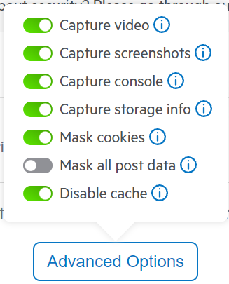

## Capture ASP.NET Web Forms network logs & log issues with Fiddler Jam

[Fiddler Jam](https://www.telerik.com/fiddler-jam) is Telerik's new tool designed to facilitate the information exchange between the support and end-user. A simple capture log from the end-user can provide a lot of information to the support team:
- Console logs and errors
- Network requests
- Local and Session Storage logs
- Video recording and screenshots

### Installing Fiddler Jam

You can download and install the Fiddler Jam Chrome extension from [Chrome Web Store page for Fiddler Jam](https://chrome.google.com/webstore/detail/fiddler-jam/fnkjlegmkbicdodlheligomlfbdblpfj). Detailed instruction on how to install the extension can be found in [Fiddler Jam Extension Installation](https://docs.telerik.com/fiddler-jam/extension/installation) article. 

## Capture a log

Once you have [installed the Fiddler Jam browser extension](#installing-fiddler-jam), you can start capturing your issue and send it to the support team. 

The detailed capturing instructions can be found in [Fiddler Jam extension - Recording a log](https://docs.telerik.com/fiddler-jam/extension/recording-a-log) while below you can find a short video demonstrating the Installation and Capture process. For convenience, you can find summarized instructions to follow more easily when capturing a log written after the video.

<iframe width="560" height="315" src="https://www.youtube.com/embed/AegKWavRSv0" title="YouTube video player" frameborder="0" allow="accelerometer; autoplay; clipboard-write; encrypted-media; gyroscope; picture-in-picture" allowfullscreen></iframe>

1. Navigate to <a href="about:blank" target="_blank">about:blank</a> or an empty page to ensure a clean capture
2. Open the Fiddler Jam extension (default shortcut is `Ctrl+Shift+F`)
3. Configure the options from the `Advanced Options` button (located above the `Start Capture` button):
   - Ensure the `Mask Post Data` switch is `disabled` if reproducing the issue triggers a postback or a POST request
   - Ensure the `Capture video` is `enabled` to provide more details and context in the capture
           
4. Click the `Start Capture button`
5. Navigate to your page (e.g. `https://mydomain.com/mypagewithissue`) in the same tab. In case you started the capture from your `https://mydomain.com/mypagewithissue` page instead of a blank page, follow the steps below to ensure a proper capture
   1. Click the address bar
   2. Press Enter to navigate
    >note **Important**: The page refresh must be from navigation to the page, otherwise the browser will use the requests from cache and will not include them in the capture
6. Reproduce or observe the issue
7. Once the issue is replicated, open the extension again(or shortcut `Ctrl+Shift+F`) and click the `Stop Capture` button
8. Proceed to [Submit a log](#submit-a-log)

## Submit a log

1. *Optional* Toggle the `Password Protection` switch and enter a password (requirements: min 8 characters, 1 uppercase letter, 1 lowercase letter, 1 number)
1. Click the `Get Link` button
1. Copy the generated link and share it in the support ticket

## See Also

* [Fiddler Jam product page](https://www.telerik.com/fiddler-jam)
* [Fiddler Jam documentation](https://docs.telerik.com/fiddler-jam/introduction)
* [General troubleshooting of JavaScript errors]()
* [Improve Your Debugging Skills with Chrome DevTools blog](https://www.telerik.com/blogs/improve-your-debugging-skills-with-chrome-devtools)
* [Fiddler Jam Security](https://docs.telerik.com/fiddler-jam/security)
