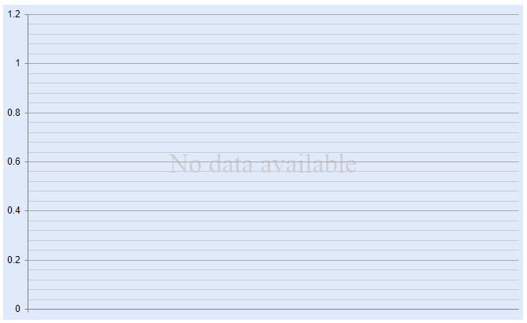

## Description

The following example demonstrates how to display a message in the HtmlChart when its data source is empty. Note that the `<div>` element of the message is positioned and decorated through `CSS`.



## Solution

````CSS
.container {
    position: relative;
}

.overlay {
    width: 100%;
    height: 100%;
    position: absolute;
    top: 0;
    left: 0;
    opacity: .2;
    background-color: #6495ed;
    text-align: center;
}

    .overlay div {
        position: relative;
        font-size: 34px;
        margin-top: -17px;
        top: 50%;
    }
````

````ASP.NET
<div class="container">
    <div class="overlay"><div>No data available</div></div>
        <telerik:RadHtmlChart ID="RadHtmlChart2" runat="server">
            <ClientEvents OnLoad="onChartLoad" />
        </telerik:RadHtmlChart>
</div>
<script>
    var $ = $ || $telerik.$;

    function onChartLoad(chartO, args) {
        var chart = chartO.get_kendoWidget();
        var view = chart.dataSource.view();
        $(".overlay").toggle(view.length === 0);
    }
</script>
````

## See Also

* [Show Empty message in Kendo UI Chart widget](https://docs.telerik.com/kendo-ui/knowledge-base/show-no-data-available-message)

 
