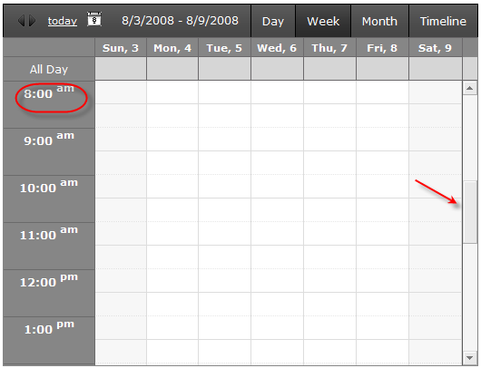

## Environment

<table>
	<tbody>
		<tr>
			<td>Product</td>
			<td>Telerik WebForms Scheduler for ASP.NET AJAX</td>
		</tr>
	</tbody>
</table>

## Description

The article demonstrates how to scroll to the 8AM time slot on initial page load. 

  

## Solution

The **CssClass** property of the 8AM time slot is set to "TimeSlotCssFor8AM" in the **TimeSlotCreated** event handler. 
Then, using JavaScript, the table cell (td) element of the specific time slot is found by its **ClassName** and the **scrollIntolView()** method is called.  

````C#
protected void RadScheduler1_TimeSlotCreated(object sender, TimeSlotCreatedEventArgs e)  
{  
    if (e.TimeSlot.Start.Hour == 8)
    {
        e.TimeSlot.CssClass = "TimeSlotCssFor8AM";
    }
} 
````

````CSS
<style>
    html body .RadScheduler .TimeSlotCssFor8AM {
        background: red;
    }
</style>
````

````JavaScript
<script>
    function pageLoad() {
        var scheduler = $find('<%= RadScheduler1.ClientID %>');
        var scrolledIntoViewSlot = $telerik.getElementByClassName(scheduler.get_element(), "TimeSlotCssFor8AM", "td");

        if (scrolledIntoViewSlot) {
            setTimeout(function () {
                scrolledIntoViewSlot.scrollIntoView();
            }, 200);
        }
    }     

    Sys.Application.add_load(pageLoad);  
</script>  
````

 